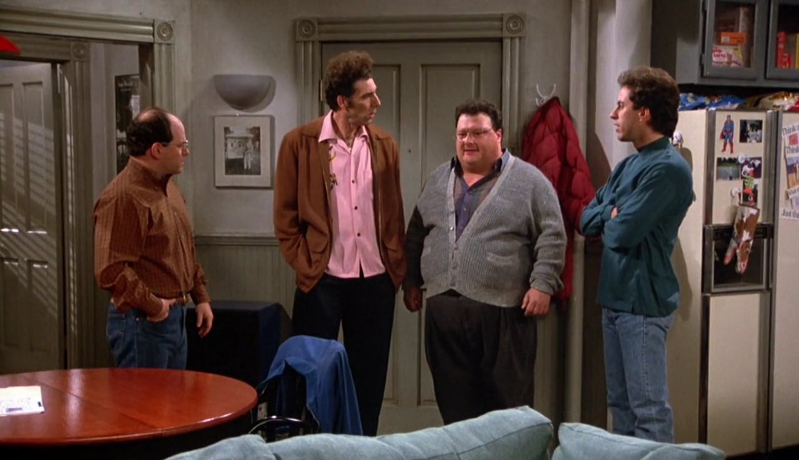

# Newman `(งツ)ว`

Newman is a discord bot that aims to have functionalities that ultimately revolve around the hit-comedy show, Seinfeld, and the hilarious Wayne Knight (AKA "Newman") in particular. This is fun side-project that I hope to maintain and have folks collaborate on in the future.

_Feel free to chime in!_

***
#### TODOs:
- ~~`core` needs some work, at the moment the code in `bot.go` is pretty much [this](https://github.com/diamondburned/arikawa#bare-minimum-bot). Need to look into the library a bit more.~~
- ~~`quotes.json` needs to be consistent with the diff we infer based on the received response (basically need accountability for "update" operations). This is more of a one-time operation, because once we are able to fetch from all such endpoints, we'll be able to cache and maintain our own dataset.~~